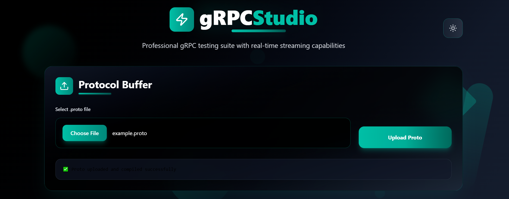
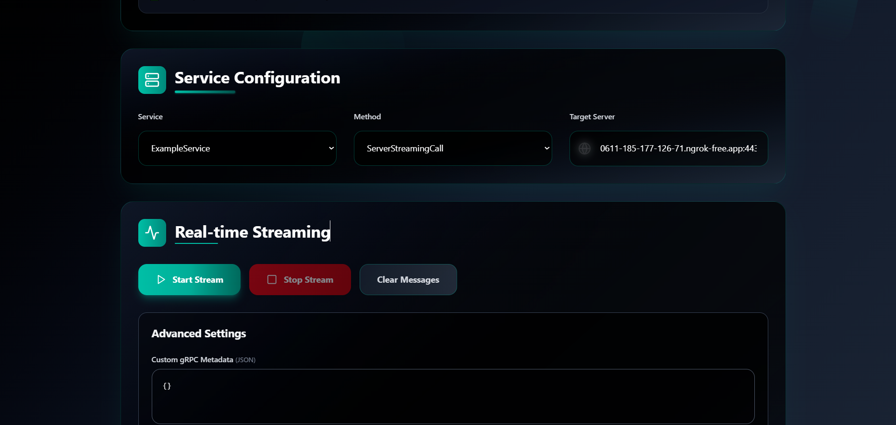
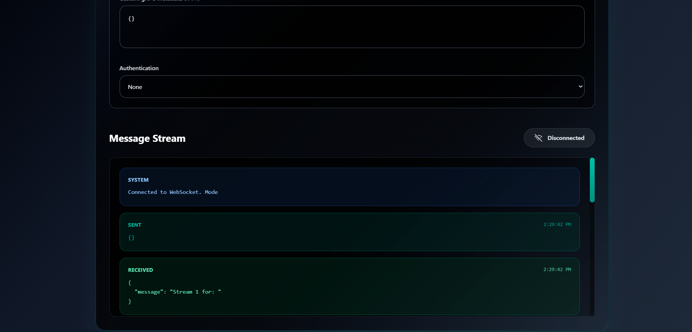

# 🚀 gRPC Web UI

A modern, browser-based UI for testing and interacting with **gRPC** services dynamically. Supports unary, server-streaming, client-streaming, and bidirectional streaming methods using WebSockets and React.

---

Paste your screenshots here (drag-drop in GitHub or use image links):









---

## ✨ Features

- 🌐 Access gRPC services from the browser using WebSockets.
- 📂 Upload `.proto` files or zipped packages.
- 🔎 Discover services and methods dynamically.
- 🔁 Support for all gRPC modes:
  - Unary
  - Server Streaming
  - Client Streaming
  - Bidirectional Streaming
- 🔒 Metadata and authentication headers support.
- 🌓 Clean and responsive UI with light/dark theme toggle.
- 📦 Deployable on EC2 or any server.

---

## 📁 Project Structure

```
grpc_ui/
├── main.go               # Gin web server
├── internals/
│   └── handler/          # gRPC + WebSocket handlers
├── uploaded_protos/      # Temp folder for uploaded .proto files
├── dist/                 # Built React UI (Vite)
├── grpcExampleServer/    # Sample gRPC server (optional)
└── ...
```

---

## 🛠️ Installation & Setup

### 1. Clone the Repository

```bash
git clone https://github.com/yourusername/grpc_ui.git
cd grpc_ui
```

### 2. Install Go & Protoc (if not installed)

```bash
# Go
sudo apt install golang

# Protoc
sudo apt install unzip
curl -OL https://github.com/protocolbuffers/protobuf/releases/download/v25.0/protoc-25.0-linux-x86_64.zip
unzip protoc-25.0-linux-x86_64.zip -d $HOME/.local
export PATH="$HOME/.local/bin:$PATH"
```

Or use the included script:
```bash
chmod +x install_protoc.sh
./install_protoc.sh
```

### 3. Install Dependencies

```bash
go mod tidy
```

### 4. Build & Run

```bash
go run main.go
```

By default, it runs on [http://localhost:8081](http://localhost:8080)

---

## 🧑‍💻 How to Use

### 🔁 Upload `.proto`

1. Drag & drop `.proto` file or `.zip` with multiple `.proto`s.
2. Service list loads dynamically.

### 🎯 Select gRPC Target

1. Enter gRPC server address (e.g., `localhost:50051`).
2. Select service and method.

### ⚙️ Metadata & Auth

- Add metadata in JSON format:
  ```json
  { "x-api-key": "12345", "authorization": "Bearer token" }
  ```

### 🔄 Streaming

- For streaming, interact in real-time:
  - Send multiple messages from client.
  - Receive multiple from server.
  - End client call with empty JSON (`{}`) if needed.

---

## 🌍 Deploy on EC2

1. Upload files to EC2.
2. Use `screen` or `nohup` to run in background:
   ```bash
   nohup go run main.go > log.txt 2>&1 &
   ```
3. Open port `8080` in EC2 Security Group.
4. Access via `http://<EC2-PUBLIC-IP>:8080`.

---

## 🧪 Sample gRPC Server

Use included sample gRPC server or your own to test.

```bash
cd grpcExampleServer
go run server.go
```

---

## 🔧 Configuration

You can customize:

- `port`, `CORS`, or WebSocket path in `main.go`
- gRPC dial options (TLS, credentials)
- UI branding from the React source

---

## 🙋 Use Cases

- ✅ Frontend debugging of gRPC endpoints
- ✅ Internal gRPC tool for dev/test teams
- ✅ Customer-facing gRPC explorer for APIs
- ✅ Local testing of protobuf definitions

---

## 📬 Feedback

Found a bug or want a feature? Raise an issue or PR!

---

## 📄 License

MIT License. See `LICENSE` for more details.
