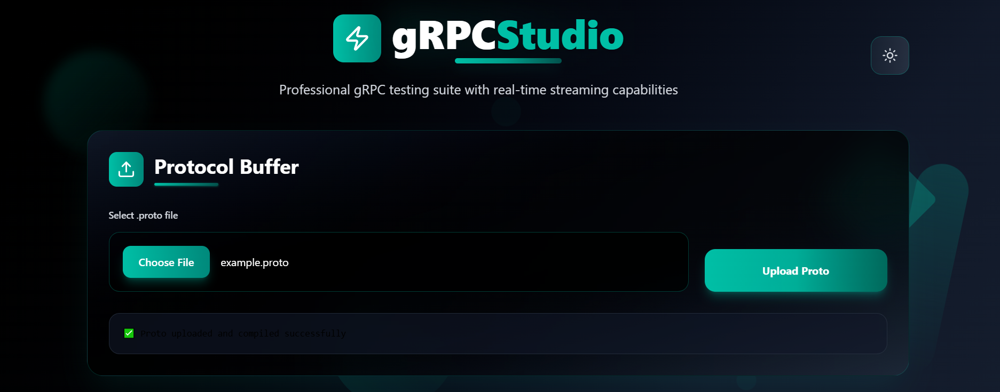
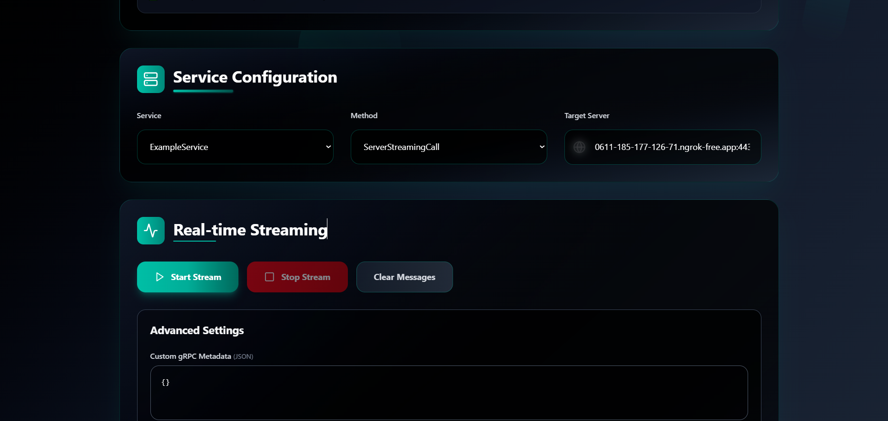
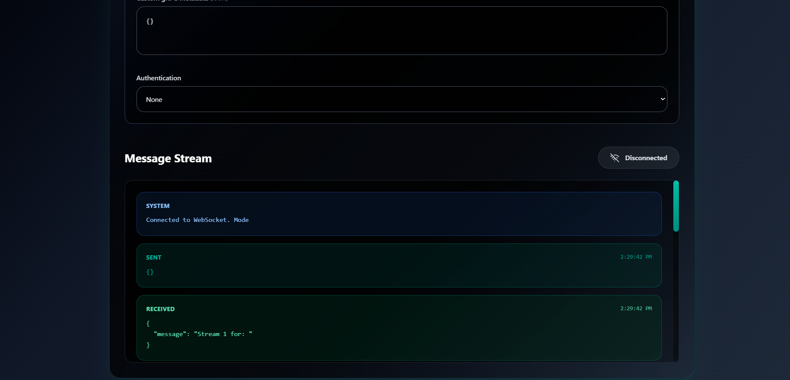
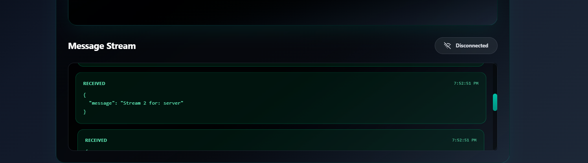
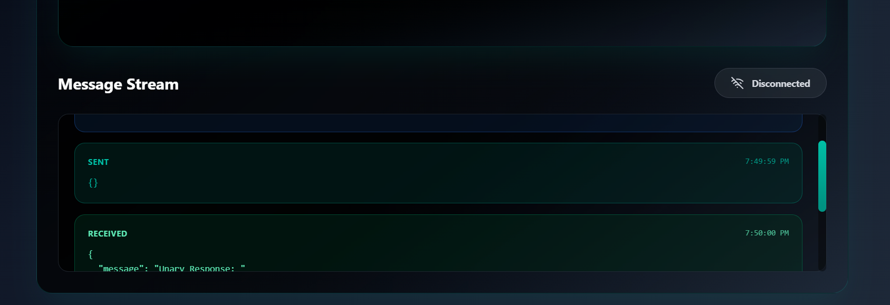

# 🚀 gRPC Web UI

A modern, browser-based UI for testing and interacting with **gRPC** services dynamically. Supports unary, server-streaming, client-streaming, and bidirectional streaming methods using WebSockets and React.

---

**🌐 Live Demo:** [http://grpcui.oomagr.me:8081](http://grpcui.oomagr.me:8081)  
**🧪 Sample gRPC Server:** [http://grpcui.omagr.me:50051](http://grpcui.omagr.me:50051)

> ⚠️ To test your own services, your gRPC server must be publicly accessible.

---

## 🌍 Make Your Server Public Using ngrok

1. **Download & install ngrok**
   ```bash
   curl -sS https://ngrok.run | sh
   ```

2. **Add your auth token**
   ```bash
   ngrok config add-authtoken <YOUR_TOKEN>
   ```

3. **Expose your gRPC server**
   ```bash
   ngrok http --app-protocol=http2 50051
   ```

---

## ✨ Features

- 🌐 Access gRPC services from the browser using WebSockets.
- 📂 Upload `.proto` files or zipped packages.
- 🔎 Discover services and methods dynamically.
- 🔁 Full gRPC method support:
  - Unary
  - Server Streaming
  - Client Streaming
  - Bidirectional Streaming
- 🔒 Supports metadata and authentication headers.
- 🌓 Responsive UI with light/dark mode.
- 🚀 Easily deployable on any cloud server (EC2, etc).

---

## 📁 Project Structure

```
grpc_ui/
├── main.go               # Gin web server entry point
├── internals/
│   └── handler/          # gRPC and WebSocket handlers
├── uploaded_protos/      # Temporary proto storage
├── dist/                 # React UI build (via Vite)
├── grpcExampleServer/    # Sample gRPC server
└── ...
```

---

## 🛠️ Installation & Setup

### 1. Clone the Repository

```bash
git clone https://github.com/yourusername/grpc_ui.git
cd grpc_ui
```

### 2. Install Go & Protoc

```bash
# Install Go
sudo apt install golang

# Install Protoc
sudo apt install unzip
curl -OL https://github.com/protocolbuffers/protobuf/releases/download/v25.0/protoc-25.0-linux-x86_64.zip
unzip protoc-25.0-linux-x86_64.zip -d $HOME/.local
export PATH="$HOME/.local/bin:$PATH"
```

Or use the helper script:
```bash
chmod +x install_protoc.sh
./install_protoc.sh
```

### 3. Install Go dependencies

```bash
go mod tidy
```

### 4. Run the Server

```bash
go run main.go
```

> Access via: [http://localhost:8081](http://localhost:8081)

---

## 🧑‍💻 How to Use

### 📂 Upload `.proto` Files

- Drag & drop a `.proto` or `.zip` file containing proto files.
- Services and methods will be loaded dynamically.

### 🎯 Connect to gRPC Server

- Input your server address (e.g., `localhost:50051` or ngrok link).
- Select the service and method you want to call.

> 💡 Use a public URL or host locally.

### 🛡 Add Metadata / Auth Headers

Provide headers in JSON format:
```json
{ "x-api-key": "12345", "authorization": "Bearer token" }
```

### 🔄 Use Streaming

- Send multiple messages for streaming methods.
- Receive real-time responses.
- To end a client stream, send an empty JSON: `{}`

---

## 🧪 Sample gRPC Server

You can test the UI with the included example server:

```bash
cd grpcExampleServer
go run server.go
```

---

## ⚙️ Customization

You can tweak:

- Port, CORS, and WebSocket settings in `main.go`
- gRPC dial options (e.g., TLS, credentials)
- UI appearance and branding via React source

---

## 🙋 Use Cases

- ✅ gRPC endpoint debugging
- ✅ Internal dev/test tools
- ✅ Public API exploration
- ✅ Proto testing with no code

---

## 🖼️ UI Screenshots

Paste these in GitHub issues or docs:

| Home | Service Explorer | Unary | Streaming |
|------|------------------|-------|-----------|
|  |  |  |  |

Other:
- 
- 
- 
- 
- 

---

## 📬 Feedback & Contributions

Have suggestions or found a bug? Feel free to open an issue or PR.

---
